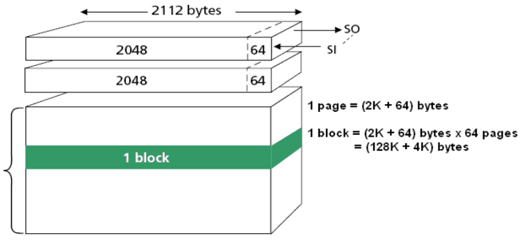

# BCH Primitive Polynomial Search for Flash Dump

[BCH algorithm](https://en.wikipedia.org/wiki/BCH_code) is widely used for ECC calculation and bitflip protection in NAND flash memory. By storing a small amount parity data along with the main data to be protected, the algorithm could detect and correct bitflips up to a certain extend. However, this also makes the process of reading and writing data onto the flash chip a bit less transparent especially when vendors decide to 'tweak' the algorithm by using different paramters. 

Given a sample of real data and its parity data, the program derives ECC step size (the amount of data to protect) `m` and ECC strength (number of bitflips to protect against) `t` from the number of bytes in those files. It then generates a list of possible primitive polynomials of degree `m` over `GF(2)` and search for one that correctly encode main data into parity data.

## Prepare data and ECC files

Input files for the program can be extracted from directly flash dump. Here are steps I usually take

1. Search for the flash chip datasheet to get the size of the each page and spare area, which usually listed together as '(2K + 64) Byte'. Also, manufacturers always have one datasheet for the same model with many storage sizes which could have result in different page and spare size.



2. Open the flash dump file in a hex editor/viewer that has raw hex dump and text side by side. On the hex side, two hexadecimal numbers are grouped together to form 1 byte of data which corresponds to one character on the text side.

3. Look for the start of a page where there is readable text by making sure that start position by divisible the page size. In the example above, the start position should be a multiple of (2K + 64) or 2112 bytes.

4. Count the number of bytes from that start position until a series of non-text characters appears, that should be where the end of the data sample we will use. This number is usually the size of each page or 1/4 of that (512 bytes for the example). This section of data could be extracted with `dd` command in linux.

```bash
dd if=flashdump.bin of=data.bin skip=<start position of data in bytes> count=<length of data> bs=1
```
> Even though the size of each page is (2K + 64) or 2112 bytes of data and spare, data and ECC are ussually calculated in sections of 1/4 the size of each page. That is, 512 bytes of data then 16 bytes of spare, repeat that 4 times. See my detailed example from [Deco X50 Firmware Unpack](https://github.com/giahuy2201/Deco-X50-Firmware-Unpack).

5. Determining the size of ECC parity data which is located in the spare / Out-Of-Band area usually right after the data is a bit trickier. This requires knowing the bit strength `t` of the BCH algorithm being used which could be obtained from device boot log or device tree, commonly used ones are `t = 4` and `t = 8`. Along with ECC parity data, the spare areas also contain bad block marker and padding (a series of `0xFF`). Here are two commonly used bit strength along with the size of ECC parity data. The calculation is implement under `find_m` function, but generally

$`\text{length\_of\_ecc\_in\_bits} = t \cdot m \text{, where } 2^m > \text{length\_of\_data\_in\_bits}`$

In this example, the device uses 4-Bit BCH on 512 bytes of data -> 7 bytes ECC parity data. 

```bash
dd if=flashdump.bin of=ecc.bin skip=<start position of ecc in bytes> count=<length of ecc> bs=1
```

> WARNING: This script assumes that there is no bitflip happened to the sample of data you extracted from the flash dump. If the search yields no result for your first sample, you should try again with another sample from the flash dump.

## Usage

Install dependencies

```bash
pip install -r requirements.txt
```

Run `search.py` with binary data files

```bash
python search.py data.bin ecc.bin
```

## References

https://bootlin.com/blog/supporting-a-misbehaving-nand-ecc-engine/